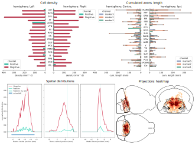

# Introduction
`cuisto` is an [open-source](https://github.com/TeamNCMC/cuisto) Python package aiming at facilitating the quantification of histological data, eg. the characterization of objects of interest in 2D images such as cells or neuronal processes revealed by immunohistochemistry or endogenously fluorescent proteins in brain slices.

It leverages [QuPath](https://qupath.readthedocs.io/en/stable/) measurements export to collate data from different slices and subjects, derive quantifying metrics within regions of interest, compute spatial distributions and generate graphs, featuring human-readable [configuration files](main-configuration-files.md) to easily customize `cuisto` behavior to best match your use-case.

In theory, `cuisto` should work with any measurements table with the [required columns](guide-prepare-qupath.md#qupath-requirements), but has been designed with QuPath in mind, especially used alongisde [ABBA](https://abba-documentation.readthedocs.io/en/latest/) to align 2D images on a reference brain atlas.

For atlas-related features, including ontology-based blacklisting and structures contours drawing for heatmaps, `cuisto` relies on the [Brainglobe Atlas API](https://brainglobe.info/documentation/brainglobe-atlasapi/index.html), thus supporting all [atlases packaged](https://brainglobe.info/documentation/brainglobe-atlasapi/usage/atlas-details.html#available-atlases) in Brainglobe. 

After [ABBA registration](guide-register-abba.md) of 2D histological slices and QuPath [objects' detection](guide-qupath-objects.md), `cuisto` is used to :

+ compute metrics, such as objects density in each brain regions,
+ compute objects distributions in three three axes (rostro-caudal, dorso-ventral and medio-lateral),
+ compute averages and sem across animals,
+ display all the above.

`cuisto` processing abilities revolve around two [QuPath core concepts](https://qupath.readthedocs.io/en/stable/docs/concepts/objects.html#annotations-detections), Annotations (regions of interest) and Detections (objects of interest). The repository hosting the `cuisto` package provides [QuPath utility scripts](https://github.com/TeamNCMC/cuisto/tree/main/scripts/qupath-utils) to help you process and format the data within QuPath before export.

This documentation covers the whole process depicted above, including `cuisto` [installation instructions](guide-installation.md#install-cuisto), ABBA [installation instructions](guide-install-abba.md), guides to [prepare images](guide-create-pyramids.md) for the pipeline, [detect objects](guide-qupath-objects.md) with QuPath, [register 2D slices on a 3D atlas](guide-register-abba.md) with ABBA, and [`cuisto` usage](guide-use-cuisto.md#using-cuisto) along with [examples](main-using-notebooks.md).

Due to the IT environment of the laboratory, this documentation is very Windows-oriented but most of it should be applicable to Linux and MacOS as well by slightly adapting terminal commands.

## Documentation navigation
The documentation outline is on the left panel, you can click on items to browse it. In each page, you'll get the table of contents on the right panel.

## Useful external resources
+ Project repository : [https://github.com/TeamNCMC/cuisto](https://github.com/TeamNCMC/cuisto)
+ QuPath documentation : [https://qupath.readthedocs.io/en/stable/](https://qupath.readthedocs.io/en/stable/)
+ Aligning Big Brain and Atlases (ABBA) documentation : [https://abba-documentation.readthedocs.io/en/latest/](https://abba-documentation.readthedocs.io/en/latest/)
+ Brainglobe : [https://brainglobe.info/](https://brainglobe.info/)
+ BraiAn, a similar project featuring a dedicated QuPath extension : [https://silvalab.codeberg.page/BraiAn/](https://silvalab.codeberg.page/BraiAn/)
+ Image.sc community forum : [https://forum.image.sc/](https://forum.image.sc/)
+ *Introduction to Bioimage Analysis*, an interactive book written by QuPath's creator : [https://bioimagebook.github.io/index.html](https://bioimagebook.github.io/index.html)

## Credits
`cuisto` has been primarly developed by [Guillaume Le Goc](https://legoc.fr) in [Julien Bouvier's lab](https://www.bouvier-lab.com/) at [NeuroPSI](https://neuropsi.cnrs.fr/). The clever name was found by Aurélie Bodeau.

The documentation itself is built with [MkDocs](https://www.mkdocs.org/) using the [Material theme](https://squidfunk.github.io/mkdocs-material/).