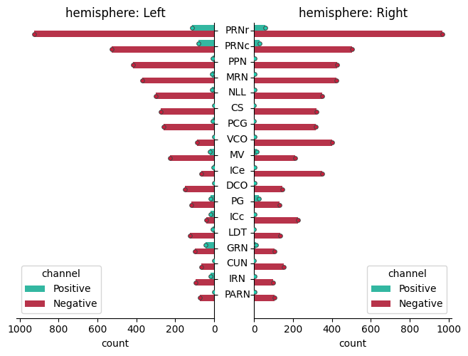
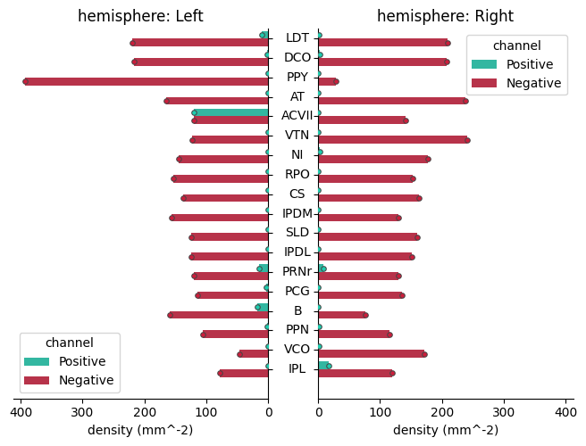
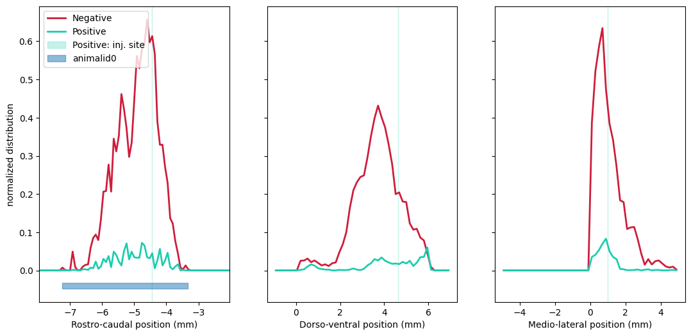
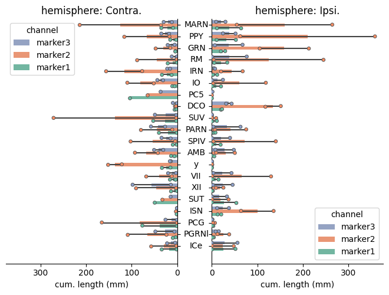
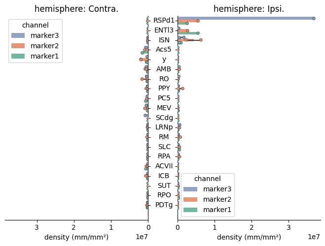

# Quick start

!!! info
    You should be familiar with the command line, the [QuPath core concepts](https://qupath.readthedocs.io/en/stable/docs/starting/first_steps.html) and some basic Python know-how. Otherwise, you might want to check-out the full [installation guide](guide-installation.md).

## Installation
1. Install [QuPath](https://qupath.github.io), [ABBA](https://teamncmc.github.io/cuisto/guide-install-abba.html) and [conda](https://conda-forge.org/download/).
2. Create an environment :
```
conda create -c conda-forge -n cuisto-env python=3.12
```
3. Activate it :
```
conda activate cuisto-env
```
4. Install `cuisto`
```
pip install cuisto
```
If you want to build the doc locally :
```
pip install cuisto[doc]
```

## Data preparation
There are some required steps to take with the data prior to use `cuisto` for final results. You can find a prerequisites checklist [here](guide-use-cuisto.md#prerequisites-checklist). There is also a [pipeline](guide-pipeline.md) that you can follow beforehand : this will handle the various files locations and related paths used by `cuisto` so it is easier to use afterwards.

The process of preparing the data before analysis is the following :

1. Acquire some imaging data
2. Make sure the images are [pyramidal](guide-create-pyramids.md)
3. Create a [QuPath project](guide-qupath-objects.md#qupath-project)
4. Use ABBA to [register your slices on a reference brain atlas](guide-register-abba.md) to get brain regions (so called Annotations). Alternatively, draw custom Annotations directly within QuPath -- make they sure they are [formatted as expected](guide-prepare-qupath.md#annotations) by `cuisto`
5. [Find](guide-qupath-objects.md) objets of interests (so called Detections) in your slices with QuPath
6. [Add](guide-prepare-qupath.md#adding-measurements) measurements to those annotations : objects count, cumulated length, ... [Atlas coordinates](guide-prepare-qupath.md#detections) can also be added to the detections measurements to compute and plot spatial distributions.
7. [Export](guide-prepare-qupath.md#qupath-export) the data from QuPath

## Usage
Once you have a bunch of pairs of CSV files (one for annotations, one for detections), you can use `cuisto` to collate the data, derive quantifying metrics and spatial distrubutions and plot the results in a configurable manner. You'll need a [configuration file](main-configuration-files.md#configtoml), a text file easily editable to match your needs.

### Two types of cells detected in a single animal
Gather data, compute metrics :

```python
import cuisto
import pandas as pd

animal = "animal_id"

# files paths
config_file = "/path/to/config.toml"
annotations_file = "/path/to/annotations.tsv"
detections_file = "/path/to/detections.tsv"

# read configuration and data
cfg = cuisto.config(config_file)
df_annotations = pd.read_csv(annotations_file, sep="\t")
df_detections = pd.read_csv(detections_file, sep="\t")

# pool brain regions from different slices, compute density and spatial distributions
df_regions, dfs_distributions, df_coordinates = cuisto.process.process_animal(
    animal, df_annotations, df_detections, cfg, compute_distributions=True
)
```
Display raw object count and density per regions :

```python
cuisto.display.plot_regions(df_regions, cfg)
```




Display spatial distributions (pdf) along the three axes :



Check the full example notebook [here](demo_notebooks/cells_distributions.ipynb).

### Axons with three staining from two animals
This dataset was analyzed fulfilling the [pipeline requirements](guide-pipeline.md) : `some_directory` contains a folder per animal.

```python
import cuisto

# Parameters
wdir = "/path/to/some_directory"
animals = ["AnimalID0", "AnimalID1"]
config_file = "/path/to/your/config.toml"
output_format = "h5"  # to save the quantification values as hdf5 file

# Processing
cfg = cuisto.Config(config_file)
df_regions, _, _ = cuisto.process.process_animals(
    wdir, animals, cfg, out_fmt=output_format
)

# Display
cuisto.display.plot_regions(df_regions, cfg)
```




Check the full example notebook [here](demo-notebooks/fibers_length_multi.ipynb).